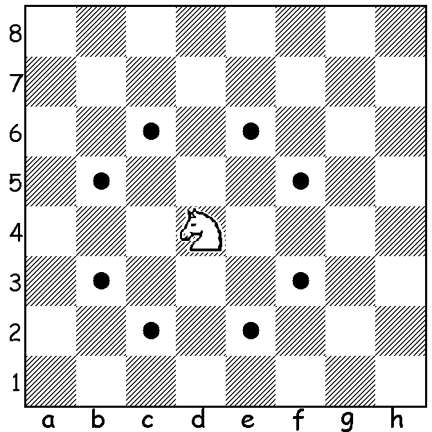

# knightMoves

Ever wonder what the smallest number of moves for a knight would be from it's starting square to another square on the chessboard? Of course you have!  Hopefully this project will resolve the question - in general. 

---

